# Wavern - Local Music Visualizer

<p align="center">
  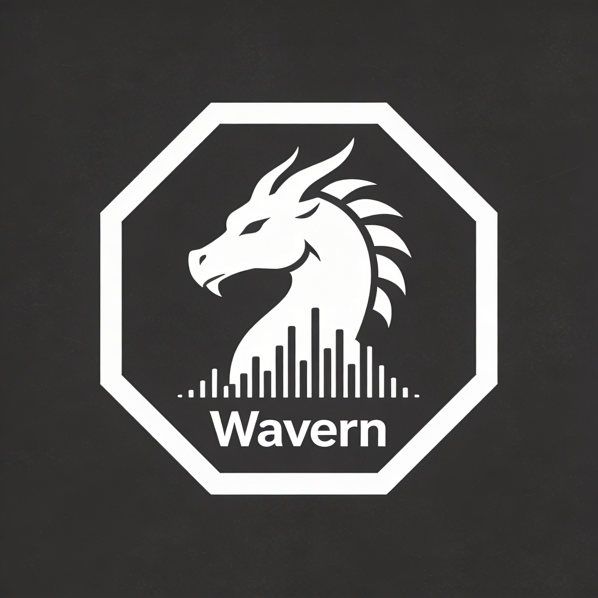
</p>

<p align="center">
  <a href="LICENSE"></a>
  <a href="https://www.python.org/downloads/release/python-3120/"></a>
  <a href="https://docs.astral.sh/uv/"></a>
  <a href="https://github.com/astral-sh/ruff"></a>
  <a href="https://github.com/Lorakszak/wavern/issues"></a>
  <a href="https://github.com/Lorakszak/wavern/commits/main"></a>
</p>


<p align="center">
  
  
  <a href="https://github.com/Lorakszak/wavern/stargazers"></a>
</p>

Wavern is a local music visualizer for Linux. It renders GPU-accelerated audio visualizations in real time and exports them as video. No cloud, no subscriptions, no latency. Designed for musicians, streamers, and VJs who want full creative control.

## Table of Contents

- [Wavern - Local Music Visualizer](#wavern---local-music-visualizer)
  - [Table of Contents](#table-of-contents)
  - [Demo](#demo)
  - [Features](#features)
  - [Requirements](#requirements)
  - [Installation](#installation)
  - [Project Layout](#project-layout)
  - [Development](#development)
  - [Usage](#usage)
    - [GUI](#gui)
    - [Headless Video Export](#headless-video-export)
    - [CLI Reference](#cli-reference)
  - [Keyboard Shortcuts](#keyboard-shortcuts)
    - [Playback \& Transport](#playback--transport)
    - [Volume](#volume)
    - [File](#file)
    - [View](#view)
    - [Visualization](#visualization)
  - [Built-in Visualizations](#built-in-visualizations)
  - [Presets](#presets)
    - [Exploring Some of Built-in Presets and Themes](#exploring-some-of-built-in-presets-and-themes)
      - [Cyberpunk Skyline (builtin) for Spectrum Bars at Dark Theme](#cyberpunk-skyline-builtin-for-spectrum-bars-at-dark-theme)
      - [Deep Ocean Pulse (builtin) for Circular Spectrum at Dracula Theme](#deep-ocean-pulse-builtin-for-circular-spectrum-at-dracula-theme)
      - [Lissajous (builtin) for Lissajous at Gruvbox Theme](#lissajous-builtin-for-lissajous-at-gruvbox-theme)
      - [Neon Fortress (builtin) for Rectangle Spectrum at Light Theme](#neon-fortress-builtin-for-rectangle-spectrum-at-light-theme)
      - [Shadow Cascade (builtin) for Spectrum Bars at Nord Theme](#shadow-cascade-builtin-for-spectrum-bars-at-nord-theme)
  - [Known Issues](#known-issues)
  - [Roadmap](#roadmap)
  - [FAQ](#faq)
  - [Contributing](#contributing)
  - [Acknowledgements](#acknowledgements)
  - [Changelog](#changelog)
  - [License](#license)

## Demo

**TODO**: *Demo recording coming soon.*

## Features

- **Real-time preview** - OpenGL 3.3+ GPU-accelerated visualization synced to audio playback
- **9 built-in visualizations** - Spectrum Bars, Classic Waveform (Beta), Circular Spectrum, Rectangle Spectrum, Particle Burst (Beta), Smoky Waves (Beta), Lissajous (Alpha), Radial Waveform (Alpha), Spectrogram (Alpha)
- **Full parameter control** - every visualization exposes tunable parameters (bar count, speed, thickness, etc.) with live preview via drag-to-change spinboxes
- **Visualization memory** - switching visualization types preserves your parameter tweaks; switch back and your settings are restored
- **Dual tabbed sidebars** - two independent sidebars with tabs (Visual, Text, Export, Presets, Analysis), each with optional vertical split mode
- **5 built-in themes** - Dark, Light, Nord, Dracula, Gruvbox — persists across sessions
- **Color palettes** - multi-color gradients applied across visualizations
- **28 built-in presets** - ranging from showcase demos to utility starting points; favorites, source filter, and item size toggle in the preset panel
- **Video & image backgrounds** - with movement effects (drift, shake, wave, zoom_pulse, breathe), rotation, and mirror transforms
- **Video overlay compositing** - layer a video above the visualization with alpha, additive, or screen blend modes
- **Advanced audio analysis** - bass-weighted beat detection with adaptive threshold, dB magnitude normalization, amplitude envelope, and spectral flux
- **Preset system** - save/load/share visualization configurations as JSON files; user presets at `~/.config/wavern/presets/`
- **Transparent export** - render with no background for compositing (WebM/VP9 with alpha)
- **Headless CLI rendering** - batch export videos from presets without opening the GUI

## Requirements

- Python 3.12
- [uv](https://docs.astral.sh/uv/) package manager
- ffmpeg (for video export)
- OpenGL 3.3+ capable GPU
- Linux with PulseAudio or PipeWire (for audio playback via sounddevice/PortAudio)

## Installation

Make sure all requirements are met (Python 3.12 via pyenv/asdf, uv, ffmpeg, OpenGL drivers for your GPU).

```bash
git clone https://github.com/Lorakszak/wavern && cd wavern
uv sync                    # runtime dependencies
uv sync --extra dev        # + dev dependencies: pytest, ruff, mypy
```

## Project Layout

```
wavern/
  audio/           - place audio files here (default import directory)
  video/           - exported videos land here (default export directory)
  src/wavern/      - main package
  tests/           - pytest test suite
  plugins/         - plugin development guide
```

## Development

Install dev dependencies - includes **pytest** and **pytest-qt** (testing), **ruff** (linting), and **mypy** (type checking):

```bash
uv sync --extra dev
```

Run the full quality pipeline:

```bash
uv run pytest tests/ -v        # run test suite
uv run ruff check src/         # lint
uv run ruff check src/ --fix   # auto-fix safe issues
uv run mypy src/               # type-check
```

## Usage

### GUI

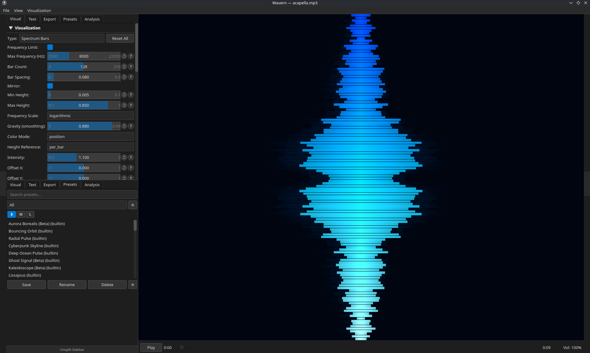

```bash
uv run wavern gui                          # launch empty
uv run wavern gui audio/song.mp3           # launch with audio file
uv run wavern gui song.mp3 --preset "Neon Spectrum"  # launch with preset
```

Import audio via **File > Import Audio** (Ctrl+O) or pass a file path as argument. The sidebar provides tabbed panels for Visual, Text, Export, Presets, and Analysis settings. Toggle a second sidebar with Ctrl+Shift+B. Switch themes via **View > Theme**. Render via **File > Render Video** (Ctrl+E).

### Headless Video Export

```bash
uv run wavern render audio/song.mp3 \
  --preset "Neon Spectrum" \
  --output video/output.mp4 \
  --resolution 1920x1080 \
  --fps 60 \
  --crf 18
```

For transparent background (no background, just the visualization):

```bash
uv run wavern render audio/song.mp3 \
  --preset "My Preset" \
  --output video/output.webm \
  --format webm
```

### CLI Reference

```bash
uv run wavern list-presets          # show all available presets
uv run wavern list-visualizations   # show registered visualization types
```

## Keyboard Shortcuts

### Playback & Transport

| Shortcut | Action |
|----------|--------|
| `Space` | Play / Pause |
| `Left` / `Right` | Seek +/-5 seconds |
| `h` / `l` | Seek +/-5 seconds |
| `Shift+Left` / `Shift+Right` | Seek +/-1 second |
| `Shift+h` / `Shift+l` | Seek +/-1 second |
| `Home` | Go to start |
| `0` - `9` | Jump to 0% - 90% of track |

### Volume

| Shortcut | Action |
|----------|--------|
| `Up` | Volume +5% |
| `Down` | Volume -5% |
| `Ctrl+Up` | Volume +25% |
| `Ctrl+Down` | Volume -25% |
| `M` | Mute / Unmute |

### File

| Shortcut | Action |
|----------|--------|
| `Ctrl+O` | Import Audio |
| `Ctrl+E` | Render Video |
| `Ctrl+S` | Save Preset As |
| `Ctrl+Q` | Quit |

### View

| Shortcut | Action |
|----------|--------|
| `Ctrl+B` | Toggle Left Sidebar |
| `Ctrl+Shift+B` | Toggle Right Sidebar |
| `F` / `F11` | Toggle Fullscreen |

### Visualization

| Shortcut | Action |
|----------|--------|
| `Ctrl+Tab` | Cycle between all visualization types |
| `Ctrl+1` | Switch to Classic Waveform (Beta) |
| `Ctrl+2` | Switch to Spectrum Bars |
| `Ctrl+3` | Switch to Circular Spectrum |
| `Ctrl+4` | Switch to Rectangle Spectrum |
| `Ctrl+5` | Switch to Particle Burst (Beta) |
| `Ctrl+6` | Switch to Smoky Waves (Beta) |
| `Ctrl+7` | Switch to Lissajous (Alpha) |
| `Ctrl+8` | Switch to Radial Waveform (Alpha) |
| `Ctrl+9` | Switch to Spectrogram (Alpha) |


## Built-in Visualizations

| Name | Status | Preview | Description |
|------|--------|---------|-------------|
| Classic Waveform | Beta |  | Audio waveform as a line or filled shape |
| Spectrum Bars | Stable | 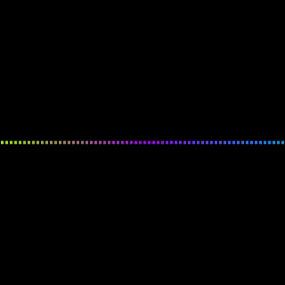 | Vertical bar spectrum analyzer with logarithmic frequency binning |
| Circular Spectrum | Stable | 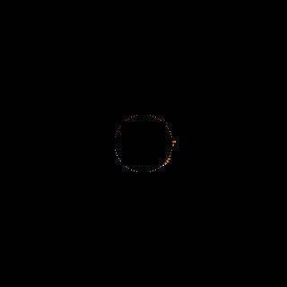 | Radial bars arranged around a rotating circle |
| Rectangle Spectrum | Stable | 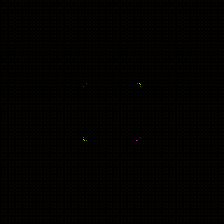 | Spectrum bars arranged around a rectangle |
| Particle Burst | Beta | 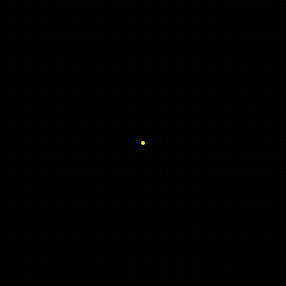 | Audio-reactive particle system with burst effects on beats |
| Smoky Waves | Beta |  | Layered sinusoidal waves with audio-reactive turbulence |
| Lissajous | Alpha | 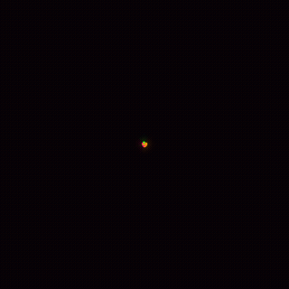 | Phase-portrait plot (X=waveform[i], Y=waveform[i+delay]) with rotational symmetry and beat-reactive glow |
| Radial Waveform | Alpha | 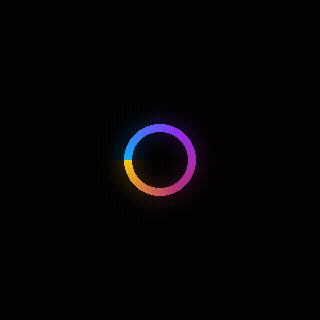 | Time-domain waveform wrapped around a circle; pulses and breathes with transients |
| Spectrogram | Alpha |  | Scrolling frequency heatmap with 6 colormaps, log/mel/linear scale, and Gaussian blur |

## Presets

28 built-in presets ship with the package, covering all visualization types from utility starting points to showcase demos (aurora_borealis, cyberpunk_skyline, ghost_signal, etc.). The preset panel includes:

- **Search** — filter by name
- **Source filter** — show All, Built-in only, or User only
- **Favorites** — star presets and toggle favorites-only view; persisted to `~/.config/wavern/favorites.json`
- **Item size toggle** — S/M/L list item sizes, persisted across sessions

Custom presets are saved to `~/.config/wavern/presets/` as JSON files. Use the **Save** button in the GUI or copy preset JSON files directly.

### Exploring Some of Built-in Presets and Themes

#### Cyberpunk Skyline (builtin) for Spectrum Bars at Dark Theme
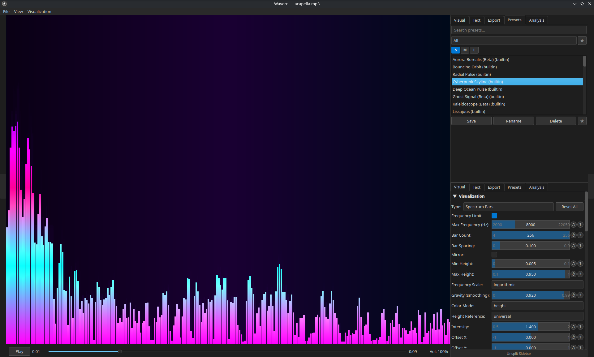

#### Deep Ocean Pulse (builtin) for Circular Spectrum at Dracula Theme
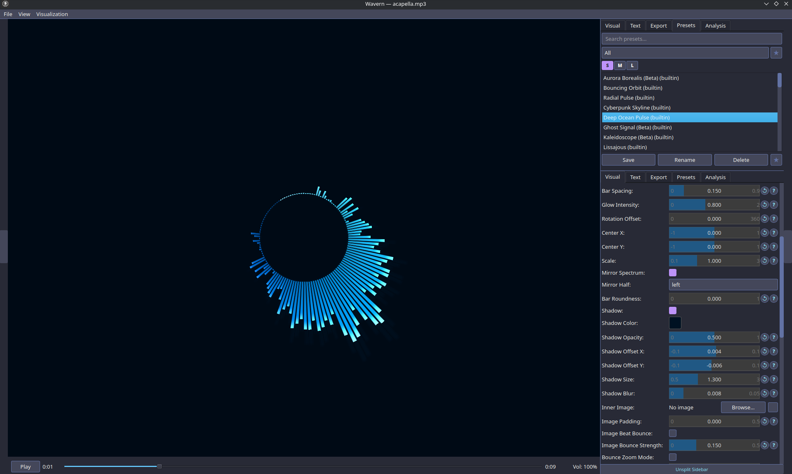

#### Lissajous (builtin) for Lissajous at Gruvbox Theme
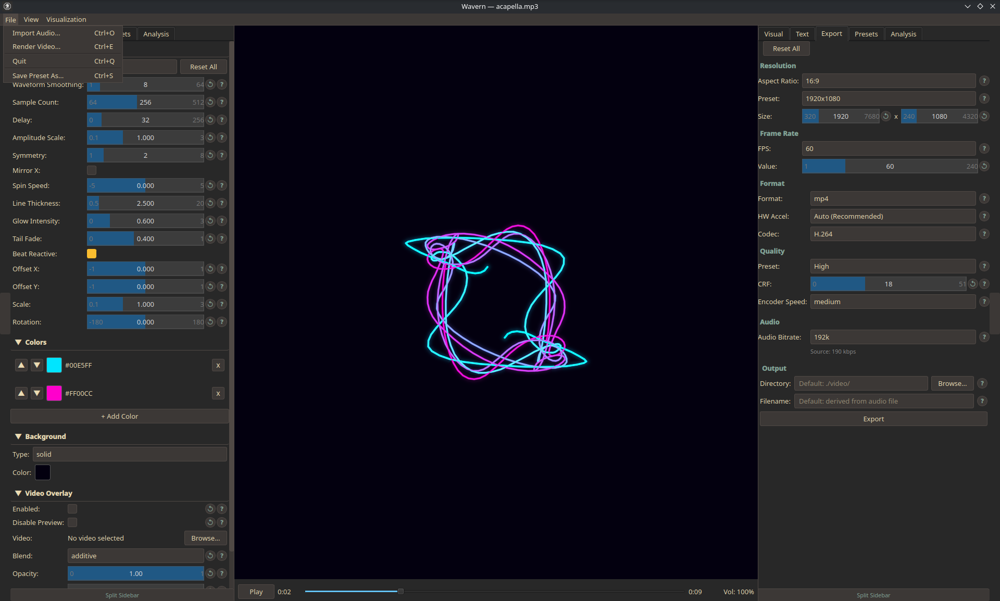

#### Neon Fortress (builtin) for Rectangle Spectrum at Light Theme
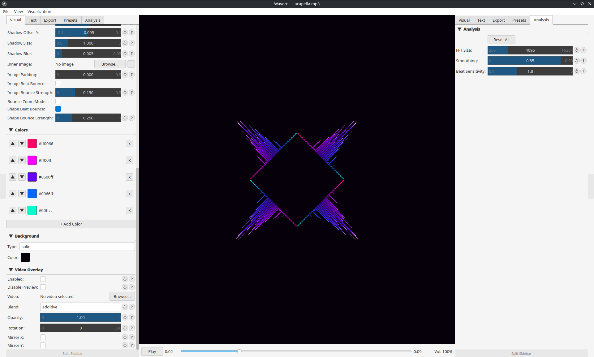

#### Shadow Cascade (builtin) for Spectrum Bars at Nord Theme
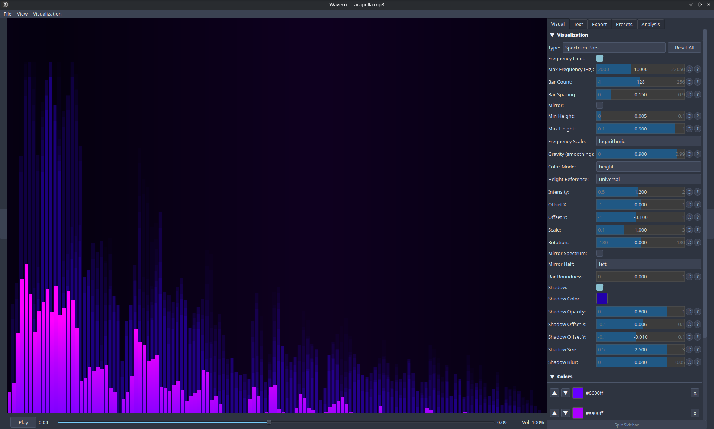


## Known Issues

- **Tested on Linux (Fedora Wayland + KDE) ONLY** - audio playback relies on PortAudio/PulseAudio/PipeWire. Windows and macOS were **NOT** tested
- **Display server required for GUI** - the GUI requires a running X11 or Wayland session. Headless CLI export (`wavern render`) works without a display.
- **Background image/video stretching** - background images are naively stretched to fill the canvas; cover/contain/letterbox modes are not yet implemented.
- **Large audio files** - very long tracks (60+ min) may cause elevated memory usage during initial load as the full waveform is pre-analyzed.

## Roadmap

Planned for future releases (not in priority order):

- [ ] Video Demo
- [ ] Per-visualization preview GIFs in documentation
- [ ] GitHub Actions CI (lint + test on push)
- [ ] Background image cover/contain/letterbox scale modes
- [ ] Plugin auto-loading from `~/.config/wavern/plugins/` (infrastructure exists, not yet wired)
- [ ] More built-in visualizations (Mandala, Audio Ribbons, Voronoi Pulse, ...)
- [ ] macOS / Windows investigation (audio backend portability)

Community contributions toward any of these are welcome. See [CONTRIBUTING.md](CONTRIBUTING.md).

## FAQ

**The GUI won't start / crashes immediately.**

Check that your GPU supports OpenGL 3.3+:
```bash
glxinfo | grep "OpenGL version"   # X11
```
Ensure OpenGL drivers are installed (Mesa or proprietary). The menu bar is forced in-window on Wayland, so no extra environment variables are needed.

**No audio playback / PortAudio error.**

Wavern uses sounddevice which requires PortAudio. Install it:
```bash
sudo dnf install portaudio        # Fedora
sudo apt install portaudio19-dev  # Debian/Ubuntu
```
Make sure PulseAudio or PipeWire is running (`pactl info` / `pw-cli info`).

**`ffmpeg` not found during export.**

```bash
sudo dnf install ffmpeg           # Fedora (enable RPM Fusion first)
sudo apt install ffmpeg           # Debian/Ubuntu
```

**What audio formats are supported?**

Any format that ffmpeg can decode: MP3, FLAC, WAV, OGG, AAC, M4A, and more. The file is decoded to a numpy array at import time.

**Transparent export produces a black background.**

Use `--format webm` (VP9/WebM supports alpha). MP4/H.264 does not support an alpha channel.

**Can I add my own visualizations?**

The plugin infrastructure exists (see `plugins/README.md` and [CONTRIBUTING.md](CONTRIBUTING.md)) but automatic drop-in loading from `~/.config/wavern/plugins/` is not yet wired to the app. For now, the recommended path is to contribute a visualization directly to the source - see [Adding a New Visualization](CONTRIBUTING.md) in the contributing guide.

## Contributing

Contributions are welcome. See [CONTRIBUTING.md](CONTRIBUTING.md) for the full workflow: branch naming, commit conventions, how to add a visualization, and the PR checklist.

Bug reports and feature requests: use the [GitHub issue templates](https://github.com/Lorakszak/wavern/issues/new/choose).

## Acknowledgements

Wavern is built on top of these goated projects:

- [moderngl](https://github.com/moderngl/moderngl) - Python OpenGL bindings
- [PySide6](https://doc.qt.io/qtforpython/) - Qt6 GUI framework
- [numpy](https://numpy.org/) + [scipy](https://scipy.org/) - audio analysis and DSP
- [sounddevice](https://python-sounddevice.readthedocs.io/) - audio playback via PortAudio
- [ffmpeg](https://ffmpeg.org/) - video encoding and audio decoding
- [PyAV](https://pyav.org/) - video decoding for background and overlay video
- [pydantic](https://docs.pydantic.dev/) - preset schema validation
- [uv](https://docs.astral.sh/uv/) - fast Python package management
- [ruff](https://github.com/astral-sh/ruff) - linting and formatting

## Changelog

See [CHANGELOG.md](CHANGELOG.md) for version history.

## License

[GPL-3.0](LICENSE)
